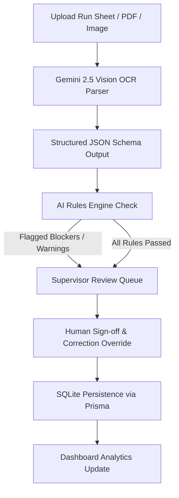

# Plant AI Document Extraction & Validation Workflow

This document explains the technical details, pipelines, and validation parameters of the AI Document Processing engine running on **OpsFlow AI**.

---

## 1. Core End-to-End Workflow Pipeline

The pipeline operates in 5 stages:

1. **Upload**: Production sheets (PDF, PNG, JPEG, JPG, CSV, JSON, TXT) are uploaded by plant operators at `/`.
2. **AI Extraction**: The file buffer is sent directly to the Google Gemini Vision API (`gemini-2.5-flash`) using a strict TypeScript JSON response schema constraint.
3. **AI Rules Validation**: Extracted fields are cross-referenced against plant limits and active database records. Any discrepancy triggers validation flags.
4. **Human Verification**: Flagged items are sent to `/review` (Awaiting Verification). The supervisor inspects the original file side-by-side with the editable inputs and corrects any transcription errors.
5. **Release & Save**: Once resolved and signed off, the record status changes to `COMPLETED` (saved) or `REJECTED`, updating the analytics dashboard in real-time.

---

## 2. Extracted Fields Schema

The Gemini model is instructed to parse exactly **8 manufacturing operation parameters**:

| Field Name | Type | Description / Formatting |
| :--- | :--- | :--- |
| **`Date`** | `String` | Date of the manufacturing run in `YYYY-MM-DD` format. |
| **`Shift`** | `String` | Plant shift name, e.g. `Morning Shift`, `Afternoon Shift`, `Night Shift`. |
| **`Employee Number`** | `String` | Unique operator ID (e.g. `EMP-241`, `EMP-902`). |
| **`Operation Code`** | `String` | Operation or task code (e.g. `OP-10`, `OP-20`, `OP-40`). |
| **`Machine Number`** | `String` | Active plant asset identifier (e.g. `Welding Robot B`, `Laser Cutter F`). |
| **`Work Order Number`**| `String` | Operational work order tracking number (e.g. `WO-5121`, `WO-3304`). |
| **`Quantity Produced`** | `Number` | Total counts of physical units successfully manufactured. |
| **`Time Taken`** | `String` | Duration or cycle time elapsed (e.g. `4.8 hours`, `6.5 hours`). |

*Note: For each field, Gemini estimates an individual reading confidence score from `0.0` to `1.0` based on character clarity and alignment.*

---

## 3. Rules Validation Engine

Our rules engine runs on every scan and human override. It categorizes issues into **Blockers** (which halt production release) and **Warnings** (informational indicators):

*   **Blocker: Batch Capacity Check**
    *   *Trigger*: Extracted `Quantity Produced` exceeds the standard batch capacity threshold of `1,000 units`.
    *   *Remedy*: Require supervisor sign-off to override/confirm higher numbers.
*   **Blocker: Machine Asset Check**
    *   *Trigger*: The extracted `Machine Number` is not registered in the plant's active SQLite asset table.
    *   *Remedy*: Correct spelling/name in the verification form.
*   **Warning: Low Confidence Check**
    *   *Trigger*: The AI reading confidence for any of the 8 fields falls below `75%` (`0.75`).
    *   *Remedy*: Highlights the input border with amber warning indicators.
*   **Warning: Employee / Work Order Format Check**
    *   *Trigger*: Missing or empty employee number or work order fields.

---

## 4. Document-Processing & Plant Performance Metrics

The application tracks three primary operational metrics displayed in the top header bar:

1.  **Plant Performance (88.5% OEE)**:
    *   Represents the plant's Overall Equipment Effectiveness (OEE) aggregate.
    *   Combines **Availability** (uptime), **Performance** (speed), and **Quality** (yield count from released run sheets).
2.  **Documents Processed Today**:
    *   A live, dynamic count of total run sheets uploaded and processed by the system today.
    *   Updates dynamically on the frontend via automatic polling.
3.  **Average OCR Confidence**:
    *   The arithmetic mean of all confidence scores generated by Gemini for active uploads.
    *   Enables quality assurance monitoring of the AI document pipeline.
